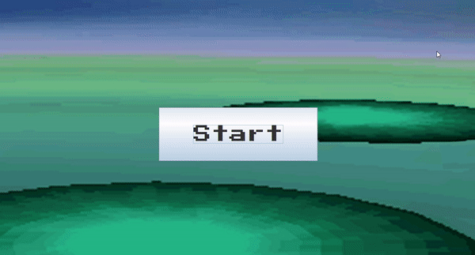

# Pokemon Game (JAVA)
This project was created to simulated Realistic and Accurate Pokemon Battles using Java and developing the GUI using the Swing library
## User Features
The user is able to:
 
* Simulate a 2-player Pokemon game
* Give themselves a name
* Choose 6 Pokemon
* Choose to fight or switch during any given turn
* Play multiple games back to back
* View the type of each move

## Future Proofing
Many design decisions were conciously chosen during programming:
* Pokemon, moves, and types read from text files. This allows more characters to be added at any further date
* Structured file system. With multiple sprites and resources, the files are organized such that adding more characters is simple

## Running Program

## Execution
The main method is in the GUI.java file in src
